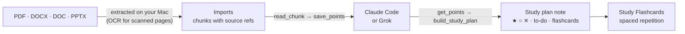
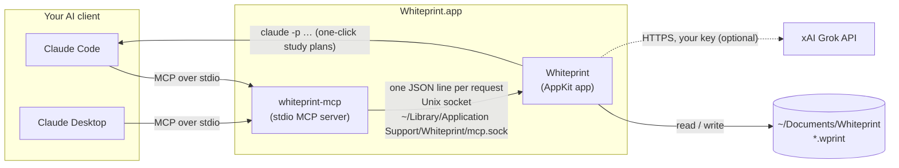
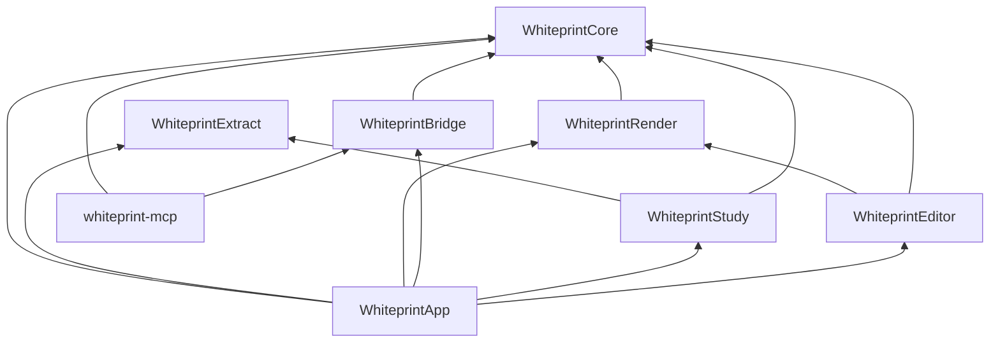
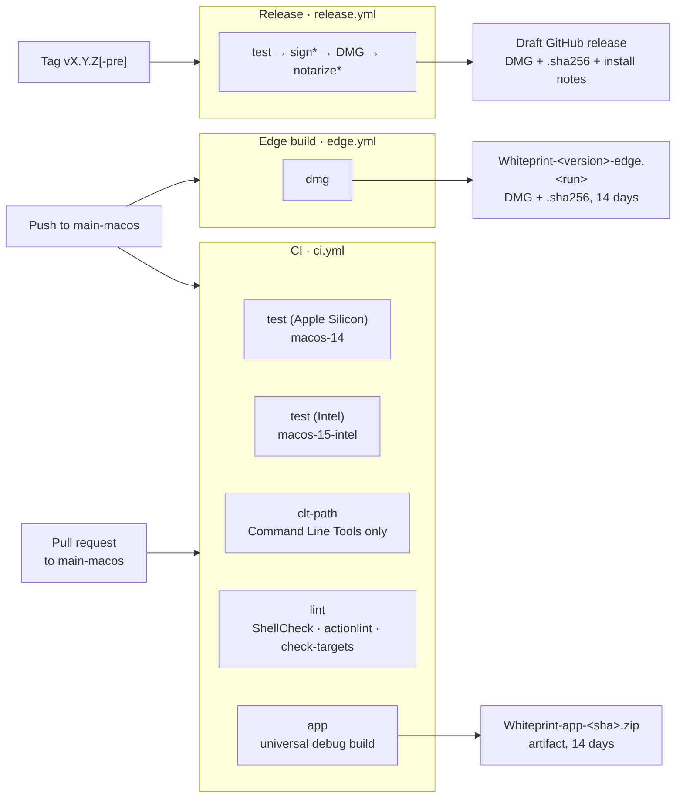

<div align="center">


# Whiteprint

**Blueprint-style notes for macOS, with Claude drawing your diagrams.**

[](https://github.com/l1203012/Whiteprint-Notetaking-Application/actions/workflows/ci.yml)
[](https://github.com/l1203012/Whiteprint-Notetaking-Application/actions/workflows/edge.yml)
[](https://github.com/l1203012/Whiteprint-Notetaking-Application/releases)
[](https://github.com/l1203012/Whiteprint-Notetaking-Application/releases)
<br>
[](#install)
[](#development)
[](#install)
[](LICENSE)

[**Download**](https://github.com/l1203012/Whiteprint-Notetaking-Application/releases) ·
[Features](#features) ·
[Claude](#connect-claude) ·
[Study](#study-plans-and-flashcards) ·
[Build](#development)

<br>


</div>

Whiteprint is a native Mac notes app where every page is a sheet of blueprint paper: blue background,
faint grid, white text. You write in Markdown with a calm, Notion-style editor. Claude connects over MCP
to read and write your notes and to draw diagrams in a compact drawing language, so a whole diagram
costs a few dozen tokens. Drop in lecture slides, PDFs or Word files and Whiteprint turns them into a
study plan with flashcards, using your own Claude subscription (or a Grok API key).

> [!NOTE]
> **Beta 1** (`v0.1.0-beta.1`) is macOS only and not notarized yet. See [first launch](#4-first-launch-of-an-unsigned-beta).

## Contents

- [Features](#features)
- [Install](#install)
- [Using Whiteprint](#using-whiteprint)
- [Connect Claude](#connect-claude)
- [Study plans and flashcards](#study-plans-and-flashcards)
- [File format](#file-format)
- [Architecture](#architecture)
- [Development](#development)
- [CI/CD](#cicd)
- [Roadmap](#roadmap) · [Contributing](#contributing) · [License](#license)

## Features

| | |
|---|---|
| 📐 **Blueprint pages** | Blue sheets, white text, a faint grid, in light and dark mode. The window chrome follows the system; the pages always stay blue. |
| ✍️ **Notion-style editor** | `/` menu, live Markdown, real checkboxes, hover handles, multi-page notes, Slides or A4 layout, Markdown syntax shown or hidden. |
| 🔷 **Drawings as text** | Boxes, databases, arrows and auto-layout in a [one-line-per-shape language](docs/DSL.md). Double-click a drawing to edit it with a live preview. |
| 🤖 **Claude over MCP** | 15 tools for notes, drawings, imports and study plans, a `whiteprint://dsl` resource and two prompts. Edits appear live in the open note. |
| 🎓 **Study plans** | PDF, Word and PowerPoint in; a note with ★ must-know / ○ good-to-know / ✕ skip tiers, a learning path, a to-do list and flashcards out. |
| 🗂️ **Flashcards** | Decks live inside notes. Study them with spaced repetition (Again / Hard / Good / Easy). |
| 📄 **Export** | PDF on blueprint paper with a title block, PDF for printing, or plain Markdown. |
| 🗃️ **Tabs and folders** | Notes are plain `.wprint` files in `~/Documents/Whiteprint`, in folders as deep as you like, opened as tabs. |
| ⌨️ **Keyboard first** | ⌘K command palette, shortcuts for every format, a Touch Bar on Macs that have one. |
| 🪶 **Light** | Native AppKit, no Electron, no web view: about 45 MB of memory with a note open. Universal binary for Intel and Apple Silicon. |

<table>
  <tr>
    <td width="50%"></td>
    <td width="50%"></td>
  </tr>
  <tr>
    <td align="center"><sub>Type <code>/</code> for blocks</sub></td>
    <td align="center"><sub><kbd>⌘</kbd><kbd>K</kbd> jumps to notes, pages and commands</sub></td>
  </tr>
  <tr>
    <td width="50%"></td>
    <td width="50%"></td>
  </tr>
  <tr>
    <td align="center"><sub>Double-click a drawing to edit its source</sub></td>
    <td align="center"><sub>Dark mode: the chrome changes, the paper doesn't</sub></td>
  </tr>
</table>

## Install


**Requirements:** macOS 13 Ventura or later, Intel or Apple Silicon. Claude Code, Claude Desktop or a
Grok API key only for the AI features.

#### 1. Download

Get `Whiteprint-<version>.dmg` and `Whiteprint-<version>.dmg.sha256` from
[**Releases**](https://github.com/l1203012/Whiteprint-Notetaking-Application/releases).

#### 2. Check the download (optional)

In Terminal, in the folder you downloaded both files to:

```sh
shasum -a 256 -c Whiteprint-0.1.0-beta.1.dmg.sha256
# Whiteprint-0.1.0-beta.1.dmg: OK
```

#### 3. Drag to Applications

Open the DMG and drag **Whiteprint** onto **Applications**, then eject the disk image.

<br clear="right">

#### 4. First launch of an unsigned beta

Beta builds are signed ad hoc, not with a Developer ID, so the first time macOS says *"Whiteprint" cannot
be opened because Apple cannot check it for malicious software* (or *"Whiteprint" Not Opened*). Open it
once in one of these ways; later launches work normally.

- **Right-click → Open.** In Finder, Control-click Whiteprint in Applications, choose **Open**, then
  **Open** again.
- **Privacy & Security.** Open Whiteprint and dismiss the warning, then go to **System Settings → Privacy
  & Security**, scroll to *"Whiteprint" was blocked…*, click **Open Anyway** and then **Open**.
- **Last resort, Terminal.** Only for a DMG from this repository whose checksum matched:

  ```sh
  xattr -dr com.apple.quarantine /Applications/Whiteprint.app
  ```

#### 5. Your notes

Notes are saved in **`~/Documents/Whiteprint`** as plain `.wprint` files; subfolders show up as folders
in the sidebar. Pick another folder in **Settings ▸ Notes**. On first launch with an empty folder,
Whiteprint writes a short Welcome note.

<details>
<summary><b>Updating and uninstalling</b></summary>

**Update:** quit Whiteprint, download the new DMG and drag Whiteprint to Applications again, choosing
**Replace**. Your notes and settings are kept. A new unsigned beta may need the first-launch step again.

**Uninstall:** quit Whiteprint and move `/Applications/Whiteprint.app` to the Trash. To remove
everything else too:

```sh
rm -rf ~/Library/Application\ Support/Whiteprint          # study imports, flashcard progress, socket
defaults delete io.github.l1203012.whiteprint             # preferences
claude mcp remove --scope user whiteprint                 # if you added it to Claude Code
```

Remove the `whiteprint` entry from `~/Library/Application Support/Claude/claude_desktop_config.json`
if you connected Claude Desktop, and the "Whiteprint – xai-api-key" item from Keychain Access if you
saved a Grok key. Your notes in `~/Documents/Whiteprint` are yours to keep or delete.

</details>

## Using Whiteprint

### Editor

- **Write Markdown.** Headings, **bold**, _italic_, `code`, lists, quotes and code blocks are styled
  as you type. With **View ▸ Show Markdown Syntax** off (the default) the markup hides except in the
  paragraph you are editing.
- **`/` menu.** Type `/` at the start of a line or after a space for Heading 1–3, Bulleted list,
  Numbered list, Checklist, Quote, Code block, Divider, Drawing, Flashcards or New page. Keep typing to
  filter, <kbd>↩</kbd> to insert.
- **Lists and checklists.** <kbd>↩</kbd> continues a list and ends it on an empty item, <kbd>⇥</kbd> /
  <kbd>⇧</kbd><kbd>⇥</kbd> indent and outdent, and `[] ` or `[x] ` at the start of a line becomes a
  checkbox. Click a checkbox to tick it.
- **Drawings.** **Note ▸ Insert Drawing** (<kbd>⇧</kbd><kbd>⌘</kbd><kbd>D</kbd>) or `/drawing`, then
  double-click it: a popover shows the source and a live preview. <kbd>⌘</kbd><kbd>↩</kbd> applies.
- **Flashcard decks.** **Note ▸ Insert Flashcards** (<kbd>⇧</kbd><kbd>⌘</kbd><kbd>F</kbd>) adds a deck
  block. Click a card to reveal its answer, **Edit** to change cards, **Study** to start a session.
- **Pages.** <kbd>⌥</kbd><kbd>⌘</kbd><kbd>N</kbd> adds a page. The sidebar's **Pages** section shows
  thumbnails of each one.
- **Hover handles** (`⋮⋮`) beside each block open a menu to delete, duplicate or move the block up or
  down, and to edit or study drawings and decks.

<table>
  <tr>
    <td width="33%"></td>
    <td width="33%"></td>
    <td width="33%"></td>
  </tr>
  <tr>
    <td align="center"><sub><b>Slides</b>: wide sheets that grow with the text</sub></td>
    <td align="center"><sub><b>A4</b>: printer paper (US Letter in the US and Canada) with the export's margins and page breaks</sub></td>
    <td align="center"><sub><b>Show Markdown Syntax</b> on</sub></td>
  </tr>
</table>

Switch with **View ▸ Page Layout** or the Touch Bar. The setting applies to every open note.

### Tabs, folders and the sidebar

Notes open as tabs of one window (<kbd>⌘</kbd><kbd>T</kbd> makes a new note in a new tab). The sidebar
has three sections:

- **Notes:** the notes folder as a tree. <kbd>⇧</kbd><kbd>⌘</kbd><kbd>N</kbd> creates a folder in the
  selected one; drag notes between folders; right-click to rename, show in Finder or move to the Trash.
- **Pages:** the current note's pages with thumbnails.
- **Study:** imported course material, **Generate study plan**, and every flashcard deck with the number
  of cards to study (due and new).

### Export

**File ▸ Export** (or the `⋯` toolbar menu):

| Format | What you get |
|---|---|
| **PDF (Blueprint)** | Blue sheets with a grid, a frame and a title block (title, date, sheet *n / m*). |
| **PDF (Print)** | The same typesetting on white paper. |
| **Markdown…** | Plain Markdown: front matter dropped, drawings replaced by `*[drawing omitted]*`, decks as lists, pages separated by rules. |

PDFs are A4 (US Letter in the US and Canada) and break pages at each note page. Drawings are not part of
the PDF in Beta 1.

<p align="center"></p>

### Keyboard shortcuts

<details open>
<summary><b>Shortcuts from the menus</b></summary>

| Action | Shortcut | Menu |
|---|---|---|
| New note | <kbd>⌘</kbd><kbd>N</kbd> | File |
| New tab (new note) | <kbd>⌘</kbd><kbd>T</kbd> | File |
| New folder | <kbd>⇧</kbd><kbd>⌘</kbd><kbd>N</kbd> | File |
| Open… | <kbd>⌘</kbd><kbd>O</kbd> | File |
| Duplicate | <kbd>⇧</kbd><kbd>⌘</kbd><kbd>S</kbd> | File |
| Show in Finder | <kbd>⌥</kbd><kbd>⌘</kbd><kbd>R</kbd> | File |
| Command palette | <kbd>⌘</kbd><kbd>K</kbd> | View |
| Toggle sidebar | <kbd>⌘</kbd><kbd>\\</kbd> | View |
| Show Markdown syntax | <kbd>⇧</kbd><kbd>⌘</kbd><kbd>M</kbd> | View |
| Full screen | <kbd>⌃</kbd><kbd>⌘</kbd><kbd>F</kbd> | View |
| Heading 1 / 2 / 3 | <kbd>⌥</kbd><kbd>⌘</kbd><kbd>1</kbd> / <kbd>2</kbd> / <kbd>3</kbd> | Format |
| Body text | <kbd>⌥</kbd><kbd>⌘</kbd><kbd>0</kbd> | Format |
| Bold / Italic | <kbd>⌘</kbd><kbd>B</kbd> / <kbd>⌘</kbd><kbd>I</kbd> | Format |
| Bulleted / Numbered list | <kbd>⌥</kbd><kbd>⌘</kbd><kbd>8</kbd> / <kbd>⌥</kbd><kbd>⌘</kbd><kbd>7</kbd> | Format |
| Checklist | <kbd>⌥</kbd><kbd>⌘</kbd><kbd>9</kbd> | Format |
| Add page | <kbd>⌥</kbd><kbd>⌘</kbd><kbd>N</kbd> | Note |
| Insert drawing | <kbd>⇧</kbd><kbd>⌘</kbd><kbd>D</kbd> | Note |
| Insert flashcards | <kbd>⇧</kbd><kbd>⌘</kbd><kbd>F</kbd> | Note |
| Find / Find and replace | <kbd>⌘</kbd><kbd>F</kbd> / <kbd>⌥</kbd><kbd>⌘</kbd><kbd>F</kbd> | Edit ▸ Find |
| Settings | <kbd>⌘</kbd><kbd>,</kbd> | Whiteprint |

Inline code, quote, code block and divider are in the **Format** menu without a shortcut.
**Note ▸ Study Flashcards…** and **Note ▸ Generate Study Plan…** start studying and a study plan run.

</details>

<details>
<summary><b>In the editor, the study window and popovers</b></summary>

| Where | Keys |
|---|---|
| Lists | <kbd>↩</kbd> continue / end, <kbd>⇥</kbd> indent, <kbd>⇧</kbd><kbd>⇥</kbd> outdent |
| `/` menu | <kbd>↑</kbd> <kbd>↓</kbd> choose, <kbd>↩</kbd> insert, <kbd>esc</kbd> close |
| Drawing popover | <kbd>⌘</kbd><kbd>↩</kbd> apply; clicking outside or <kbd>esc</kbd> also applies |
| Deck editor | <kbd>⌘</kbd><kbd>↩</kbd> done, <kbd>⌥</kbd><kbd>↩</kbd> line break in a question or answer |
| Command palette | <kbd>↑</kbd> <kbd>↓</kbd> choose, <kbd>↩</kbd> run, <kbd>esc</kbd> close |
| Study Flashcards | <kbd>Space</kbd> or <kbd>↩</kbd> flip, <kbd>1</kbd>–<kbd>4</kbd> Again / Hard / Good / Easy, <kbd>esc</kbd> close |

</details>

### Touch Bar

On a MacBook Pro with a Touch Bar, the note window shows **Toggle Sidebar**, **Command Palette** and
**New Note** on the left, a **Slides | A4** switch, a **Markdown** toggle and **Study** on the right. While
you type, the middle holds a text style popover (H1, H2, H3, Body), **Bold**, **Italic**, **Code**,
**Checklist**, **Bulleted list**, **Insert drawing**, **Insert flashcards** and **New page**. Rearrange it
with **View ▸ Customize Touch Bar…**.

## Connect Claude

Whiteprint ships a small helper, `whiteprint-mcp`, inside the app. Claude Code or Claude Desktop starts
it as an MCP server; it forwards each tool call to the running app (starting the app if needed), so
Claude's edits show up live in your open notes.


**The easy way:** open **Whiteprint ▸ Settings… ▸ AI** and click

- **Add Whiteprint to Claude Code**, which runs `claude mcp add` for your user after you confirm, or
- **Connect Claude Desktop**, which adds Whiteprint to Claude Desktop's config (other servers are kept
  and the old file is saved as `claude_desktop_config.json.backup`). Restart Claude Desktop afterwards.

**By hand, Claude Code:**

```sh
claude mcp add --scope user whiteprint -- /Applications/Whiteprint.app/Contents/MacOS/whiteprint-mcp
```

**By hand, Claude Desktop:** add this to
`~/Library/Application Support/Claude/claude_desktop_config.json`:

```json
{
  "mcpServers": {
    "whiteprint": {
      "command": "/Applications/Whiteprint.app/Contents/MacOS/whiteprint-mcp"
    }
  }
}
```

<br clear="right">

**Try asking:**

> *"List my Whiteprint notes and add a diagram of our checkout flow to System design, page 1."*
>
> *"Make a note in Courses/Networks summarising TCP congestion control, with a small diagram."*
>
> *"Turn my note Lecture 3 – TCP into 10 flashcards."*
>
> *"Import ~/Downloads/Lecture4.pdf and build me a study plan."*

<details>
<summary><b>MCP tools</b> (15)</summary>

Note ids (`n1`, `n2`, …) come from `list_notes` and last for the app session; pages are 1-based; drawing
ids (`d1`, …) are per note. Replies are short (`ok d3`); notes are never echoed back.

| Tool | Arguments | Does |
|---|---|---|
| `list_notes` | | Lists notes: id, title, pages |
| `read_note` | `note`, `page?` | Reads a note's `.wprint` source, or one page |
| `create_note` | `title`, `markdown?`, `folder?` | Creates a note, optionally in a folder such as `Courses/Networks` |
| `write` | `note`, `page`, `markdown`, `mode` (`append` \| `replace`) | Appends to or replaces a page's Markdown |
| `draw` | `note`, `page`, `dsl`, `after?` | Adds a drawing; returns its id and one line per compile error |
| `edit_drawing` | `note`, `drawing`, `dsl` | Replaces a drawing's source |
| `delete_drawing` | `note`, `drawing` | Deletes a drawing |
| `add_page` | `note` | Adds a page at the end |
| `create_flashcards` | `note?`, `page?`, `title`, `cards[]` | Adds a deck to a note's page (default: last), or to a new note |
| `import_document` | `path` | Imports a PDF, DOCX, DOC or PPTX for study |
| `list_imports` | | Lists imports: id, name, pages, chunks, status |
| `read_chunk` | `import`, `chunk` | Reads one chunk, each line tagged with its source (`slide 14`, `p. 6`) |
| `save_points` | `import`, `chunk`, `points[]` | Saves the key points of a chunk (`text`, `importance`, `ref`, `topic?`) |
| `get_points` | `import?` | Lists every saved point, compactly |
| `build_study_plan` | `imports[]`, `plan` | Writes the final study plan as a new note |

A drawing in which nothing compiles is refused, so a typo can't blank a diagram.

</details>

**Also served:** the resource **`whiteprint://dsl`** (the drawing language reference, read once before
the first drawing instead of being repeated in every tool description) and two prompts:
**`study_plan`** (optional `imports`) builds a study plan from imported material, and **`flashcards`**
(`source`, a note or import id such as `n3` or `i2`) makes a deck. In Claude Desktop they appear in
the prompt menu.

### Why drawings are cheap

Claude doesn't send SVG or coordinates for every line. It writes a few short statements; Whiteprint lays
them out, sizes boxes to their labels and clips arrows to shape edges. This diagram is six statements:

<p align="center">API>Orders>Postgres, db Postgres, two boxes and two arrows; on the right the rendered diagram on a blueprint grid"></p>

Shapes: `box`, `circle`, `db`, `text`. Lines: `arrow a>b>c`, `line a-b`, free polylines, `path`, `dim`.
Layout: `flow`, `row`, `col`, `group`. Styles: `dashed`, `thick`, `bold`. Units are grid squares. Errors
come back as one line each (`line 3: unknown id 'x'`). The full grammar is in
[docs/DSL.md](docs/DSL.md) and in the app under **Help ▸ Drawing Language**.

## Study plans and flashcards



1. **Import.** **File ▸ Import for Study Plan…** opens the study panel. Drop PDF, Word (`.docx`, `.doc`)
   or PowerPoint (`.pptx`) files in. Text is extracted locally, scanned PDF pages go through OCR, and
   repeated headers, footers and slide numbers are removed.
2. **Generate.** Click **Generate study plan**. With **Claude Code** (the default) Whiteprint runs your
   installed, logged-in `claude` in the background, limited to Whiteprint's tools, so usage counts
   against your own subscription. With **Grok** it calls xAI's API with the key you saved in **Settings
   ▸ AI** (kept in your Keychain). Progress streams into the panel.
3. **Read the plan.** The finished note opens in a new tab: an overview, a learning path with study time
   per module, every point tiered **★ must know**, **○ good to know** or **✕ can skip** with its source
   (`Lecture3.pptx · slide 14`), a `- [ ]` to-do list of assignments and deadlines, a flashcard deck and
   optional diagrams.
4. **Study.** **Study** on a deck (or **Note ▸ Study Flashcards…**) shows one card at a time. Rate each
   answer **Again / Hard / Good / Easy**; a small SM-2 scheduler brings cards back after 10 minutes or
   after days that grow with each success. The sidebar shows how many cards are waiting in each deck.

Points are saved per chunk inside Whiteprint, so long course packs don't overflow one conversation and
an interrupted run picks up where it stopped. Claude Desktop users can run the same pipeline with the
**`study_plan`** prompt.

<table>
  <tr>
    <td width="50%"></td>
    <td width="50%"></td>
  </tr>
  <tr>
    <td width="50%"></td>
    <td width="50%"></td>
  </tr>
</table>

> [!IMPORTANT]
> **Privacy.** Your files never leave your Mac. Only the extracted text is shared, and only with the AI
> client you chose: your own Claude Code or Claude Desktop, or xAI with your own key. Whiteprint never
> sees your Claude login and makes no network requests of its own except to xAI when you pick Grok.
> **Settings ▸ Study ▸ Clear Extracted Text Cache…** deletes every import.

<details>
<summary><b>Flashcard decks in notes</b></summary>


</details>

## File format

A note is one plain-text `.wprint` file (UTType `io.github.l1203012.whiteprint.note`): front matter,
Markdown, `+++page` between pages, and fenced `wp` (drawing) and `cards` (flashcard deck) blocks. It
diffs well, syncs with anything that syncs files, and Claude can read and edit it cheaply.

````text
---
whiteprint: 1
title: Lecture 3 – TCP
---
# Lecture 3 – TCP

Reliable, ordered byte streams on top of IP.

```wp id=d1
flow SYN>SYN_ACK>ACK
text "Client and server agree on sequence numbers first"
```

- [x] Re-watch the slow start animation
- [ ] Exercise 3.4

+++page

```cards id=c1
# TCP basics
Q: Name the three segments of the handshake.
A: SYN, SYN-ACK, ACK.
ref: Lecture 3 – TCP.pdf · p. 7
```
````

## Architecture



The app owns all state; the helper is a thin, stateless bridge that launches the app if it isn't
running. The MCP server is a small hand-written JSON-RPC 2.0 handler, since the official Swift SDK
needs Swift 6. Apart from the system frameworks there are no dependencies.



| Module | What it does |
|---|---|
| `WhiteprintCore` | `.wprint` format, note editing, Markdown export, drawing language compiler, study plan model. No AppKit, so it can be reused for a Windows version. |
| `WhiteprintExtract` | Local text extraction from PDF (with Vision OCR), DOCX/DOC and PPTX; cleaning and chunking with source refs |
| `WhiteprintRender` | Drawing renderer, blueprint background, Markdown styling, PDF export, page thumbnails |
| `WhiteprintEditor` | The Notion-style page editor: blocks, slash menu, drawing and deck popovers, Touch Bar |
| `WhiteprintBridge` | MCP server, tool catalog and the Unix socket between `whiteprint-mcp` and the app |
| `WhiteprintStudy` | Imports and saved points, study plan notes, the Claude Code and Grok runners |
| `WhiteprintApp` | The app: documents, window and tabs, sidebar, command palette, study panel, flashcards, settings |
| `whiteprint-mcp` | The stdio helper that Claude Code and Claude Desktop start |

## Development

**Requirements:** macOS 13+ and the Xcode **Command Line Tools** (`xcode-select --install`) with
Swift 5.8 or later. Xcode is optional: without it, the scripts build with plain `swiftc` and run the
tests through a small XCTest stand-in.

```sh
Scripts/build.sh app            # .build/Whiteprint.app for this Mac's architecture
Scripts/build.sh                # every module and both executables
Scripts/test.sh                 # every module's tests
Scripts/test.sh WhiteprintApp   # one module
Scripts/check-targets.sh        # Package.swift and Scripts/targets.sh agree
Scripts/release.sh 0.1.0        # universal, signed .build/release/Whiteprint-0.1.0.dmg + .sha256
Scripts/make-screenshots.sh     # regenerate the images in docs/images
```

`Scripts/test.sh` uses `swift test` when Xcode's XCTest is available and the stand-in otherwise; force
one with `WHITEPRINT_TEST_RUNNER=swiftpm` or `WHITEPRINT_TEST_RUNNER=shim`. With Xcode installed,
`swift build` and `swift test` work too. `CONFIG=release` and `ARCHS="arm64 x86_64"` make an optimised
universal build.

**Environment variables**, handy for trying things without touching your real notes:

| Variable | Effect |
|---|---|
| `WHITEPRINT_NOTES_DIR=/tmp/notes` | Use another notes folder |
| `WHITEPRINT_SOCKET=/tmp/wp.sock` | Use another socket, for the app and `whiteprint-mcp` |
| `WHITEPRINT_DEFAULTS_SUITE=wp-dev` | Keep preferences in a separate defaults domain |
| `WHITEPRINT_SCREENSHOTS=<dir>` | Run the scripted screenshot tour, save PNGs of the app's own windows into `<dir>` and quit |

Run a build in isolation like this:

```sh
WHITEPRINT_NOTES_DIR=/tmp/notes WHITEPRINT_SOCKET=/tmp/wp.sock WHITEPRINT_DEFAULTS_SUITE=wp-dev \
  .build/Whiteprint.app/Contents/MacOS/Whiteprint
```

<details>
<summary><b>How the screenshots are made</b></summary>

`Scripts/make-screenshots.sh` builds the app, writes demo notes and course files to `/tmp/wp-shots`, and
runs a copy of the app (with its own bundle id, socket, defaults suite and home folder, so it never
touches your notes, preferences, Keychain or Claude config) with `WHITEPRINT_SCREENSHOTS` set. The tour
in [`ScreenshotMode.swift`](Sources/WhiteprintApp/Debug/ScreenshotMode.swift) opens notes in tabs,
switches layouts, opens the palette, the study panel, the flashcard window and Settings, and captures its
own windows with `CGWindowListCreateImage`, which needs no Screen Recording permission. It also renders
the PDF export, the drawing-language example and the DMG window. The PNGs are then resized to at most
1600 px and reduced to palette images. Its windows come to the front for about half a minute.

</details>

## CI/CD



<sub>\* when the signing and notarization secrets are set.</sub>

| Workflow | Runs on | What it does |
|---|---|---|
| **CI** (`ci.yml`) | Pushes and pull requests to `main-macos` | `test (Apple Silicon)` on `macos-14` and `test (Intel)` on `macos-15-intel` with SwiftPM; `clt-path` runs `Scripts/test.sh` the Command-Line-Tools way; `lint` runs ShellCheck, actionlint and `Scripts/check-targets.sh`; `app` builds a universal debug app and uploads `Whiteprint-app-<short sha>.zip` (14 days, GitHub login needed; first launch with right-click → Open). |
| **Edge build** (`edge.yml`) | Every push to `main-macos` | Job `dmg` builds the universal DMG and uploads `Whiteprint-<version>-edge.<run number>` (DMG + `.sha256`, 14 days). No tags or releases. |
| **Release** (`release.yml`) | `vX.Y.Z` and `vX.Y.Z-pre` tags | Tests, signs with a Developer ID and notarizes when the secrets exist, builds the DMG and checksum, and creates a **draft** release (a pre-release when the version has a `-`) whose notes are GitHub's generated notes plus the install section from `.github/release-notes.md`. Re-running updates the assets. |
| **Dependabot** | Weekly | Keeps the GitHub Actions used by the workflows up to date. |

Bug and feature issue forms and a pull request template live in `.github/`. Cutting a release, signing
and notarization secrets are described in [docs/RELEASING.md](docs/RELEASING.md).

## Roadmap

Beta 1 is deliberately small. Planned or under consideration:

- [ ] Developer ID signed and notarized builds, so the first-launch step goes away
- [ ] Drawings in PDF export
- [ ] Freehand drawing, and technical sketches with arcs and angles
- [ ] iCloud sync
- [ ] Images and tables in notes
- [ ] Automatic updates (Sparkle)
- [ ] Day-by-day study schedules from deadlines found in course material
- [ ] Windows 11 version, reusing `WhiteprintCore`

See [docs/BETA_PLAN.md](docs/BETA_PLAN.md) for the original plan and open questions.

## Contributing

Bug reports and ideas are welcome: open an
[issue](https://github.com/l1203012/Whiteprint-Notetaking-Application/issues/new/choose) with the bug
or feature form. For code changes:

1. Fork, branch from `main-macos`, and keep the change focused.
2. Run `Scripts/test.sh` (and `Scripts/check-targets.sh` if you added or moved a module) before pushing.
3. Open a pull request against `main-macos`; CI runs on Intel and Apple Silicon and attaches a test
   build of the app.

Keep `WhiteprintCore` free of AppKit, keep MCP replies short, and keep the pages blue.

## License

[MIT](LICENSE) © 2026 Adam
