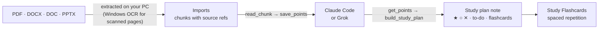
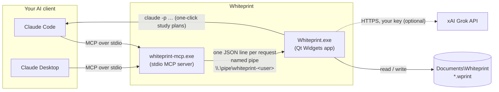
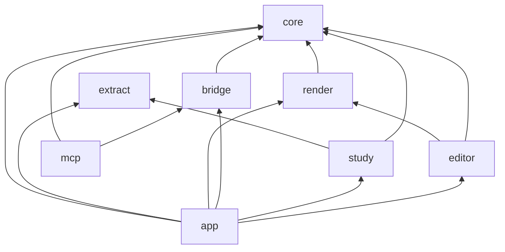
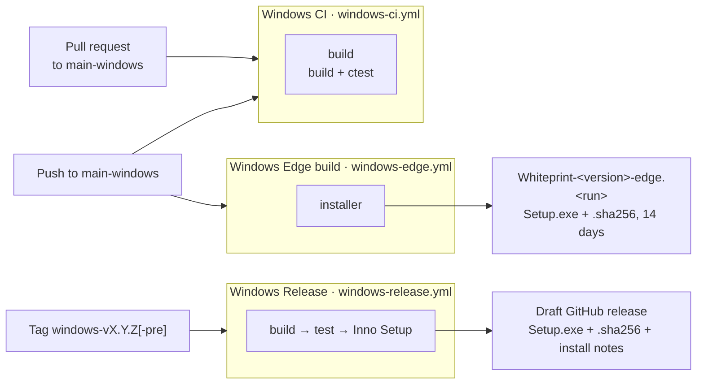

<div align="center">


# Whiteprint

**Blueprint-style notes for Windows, with Claude drawing your diagrams.**

[](https://github.com/l1203012/Whiteprint/actions/workflows/windows-ci.yml)
[](https://github.com/l1203012/Whiteprint/actions/workflows/windows-edge.yml)
[](https://github.com/l1203012/Whiteprint/releases)
[](https://github.com/l1203012/Whiteprint/releases)
<br>
[](#install)
[](#development)
[](#install)
[](LICENSE)

[**Download**](https://github.com/l1203012/Whiteprint/releases) ·
[Features](#features) ·
[Claude](#connect-claude) ·
[Study](#study-plans-and-flashcards) ·
[Build](#development)

<br>


</div>

Whiteprint is a native Windows notes app where every page is a sheet of blueprint paper: blue background,
faint grid, white text. You write in Markdown with a calm, Notion-style editor. Claude connects over MCP
to read and write your notes and to draw diagrams in a compact drawing language, so a whole diagram
costs a few dozen tokens. Drop in lecture slides, PDFs or Word files and Whiteprint turns them into a
study plan with flashcards, using your own Claude subscription (or a Grok API key).

This is the Windows version. The macOS version lives on the
[`main-macos`](https://github.com/l1203012/Whiteprint/tree/main-macos) branch; both read and write the
same `.wprint` files, so notes move between them unchanged.

> [!NOTE]
> **Version 0.1.1** is Windows 10 and 11 (64-bit) and not code-signed yet. See [first launch](#3-first-launch-of-an-unsigned-installer).

## Contents

- [Features](#features)
- [Install](#install)
- [Using Whiteprint](#using-whiteprint)
- [Connect Claude](#connect-claude)
- [Study plans and flashcards](#study-plans-and-flashcards)
- [File format](#file-format)
- [Architecture](#architecture)
- [Development](#development)
- [CI/CD](#cicd)
- [Roadmap](#roadmap) · [Contributing](#contributing) · [License](#license)

## Features

| | |
|---|---|
| 📐 **Blueprint pages** | Blue sheets, white text, a faint grid, in light and dark mode. The window chrome follows the system; the pages always stay blue. |
| ✍️ **Notion-style editor** | `/` menu, live Markdown, real checkboxes, hover handles, multi-page notes, Slides or A4 layout, Markdown syntax shown or hidden. |
| 🔷 **Drawings as text** | Boxes, databases, arrows and auto-layout in a [one-line-per-shape language](docs/DSL.md). Double-click a drawing to edit it with a live preview. |
| 🤖 **Claude over MCP** | 15 tools for notes, drawings, imports and study plans, a `whiteprint://dsl` resource and two prompts. Edits appear live in the open note. |
| 🎓 **Study plans** | PDF, Word and PowerPoint in; a note with ★ must-know / ○ good-to-know / ✕ skip tiers, a learning path, a to-do list and flashcards out. |
| 🗂️ **Flashcards** | Decks live inside notes. Study them with spaced repetition (Again / Hard / Good / Easy). |
| 📄 **Export** | PDF on blueprint paper with a title block, PDF for printing, or plain Markdown. |
| 🗃️ **Folders and windows** | Notes are plain `.wprint` files in `Documents\Whiteprint`, in folders as deep as you like; each open note gets its own window. |
| ⌨️ **Keyboard first** | <kbd>Ctrl</kbd><kbd>K</kbd> command palette and a shortcut for every format. |
| 🪶 **Light** | Native Qt Widgets, no Electron, no web view. Scanned PDFs are read with the OCR that ships with Windows. |

<table>
  <tr>
    <td width="50%"></td>
    <td width="50%"></td>
  </tr>
  <tr>
    <td align="center"><sub>Type <code>/</code> for blocks</sub></td>
    <td align="center"><sub><kbd>Ctrl</kbd><kbd>K</kbd> jumps to notes, pages and commands</sub></td>
  </tr>
  <tr>
    <td width="50%"></td>
    <td width="50%"></td>
  </tr>
  <tr>
    <td align="center"><sub>Double-click a drawing to edit its source</sub></td>
    <td align="center"><sub>Dark mode: the chrome changes, the paper doesn't</sub></td>
  </tr>
</table>

## Install

**Requirements:** Windows 10 or 11, 64-bit. Claude Code, Claude Desktop or a Grok API key only for the AI
features.

#### With winget

```powershell
winget install Whiteprint.Whiteprint
```

> [!NOTE]
> The package is submitted to the winget community repository
> ([microsoft/winget-pkgs#447499](https://github.com/microsoft/winget-pkgs/pull/447499)). Until it is
> merged, use the installer below.

#### 1. Download

Get `Whiteprint-<version>-Setup.exe` and `Whiteprint-<version>-Setup.exe.sha256` from
[**Releases**](https://github.com/l1203012/Whiteprint/releases).

#### 2. Check the download (optional)

In PowerShell, in the folder you downloaded both files to:

```powershell
(Get-FileHash Whiteprint-0.1.0-Setup.exe -Algorithm SHA256).Hash -eq (Get-Content Whiteprint-0.1.0-Setup.exe.sha256).Split(' ')[0]
# True
```

#### 3. First launch of an unsigned installer

The installer is not code-signed yet, so Windows SmartScreen may say *"Windows protected your PC"*. Click
**More info**, then **Run anyway**. The installer offers an optional desktop shortcut; later launches
work normally.

- It installs **for your user only** by default, so no administrator rights are needed. The first page
  also offers an all-users install.
- It adds Start menu (and optional desktop) shortcuts and makes `.wprint` files open in Whiteprint, with
  the app icon.

#### 4. Your notes

Notes are saved in **`Documents\Whiteprint`** as plain `.wprint` files; subfolders show up as folders in
the sidebar. Pick another folder in **Settings ▸ Notes**. On first launch with an empty folder,
Whiteprint writes a short Welcome note.

<details>
<summary><b>Updating and uninstalling</b></summary>

**Update:** run the new `Setup.exe` over the old install, or `winget upgrade Whiteprint.Whiteprint`. Your
notes and settings are kept.

**Uninstall:** **Settings ▸ Apps ▸ Installed apps ▸ Whiteprint ▸ Uninstall**, or
`winget uninstall Whiteprint.Whiteprint`. To remove everything else too:

```powershell
Remove-Item -Recurse "$env:APPDATA\Whiteprint"                # study imports, flashcard progress
Remove-Item -Recurse "HKCU:\Software\Whiteprint"              # preferences
claude mcp remove --scope user whiteprint                     # if you added it to Claude Code
```

Remove the `whiteprint` entry from `%APPDATA%\Claude\claude_desktop_config.json` if you connected Claude
Desktop, and the `io.github.l1203012.whiteprint/xai-api-key` entry from **Credential Manager** if you saved a
Grok key. Your notes in `Documents\Whiteprint` are yours to keep or delete.

</details>

## Using Whiteprint

### Editor

- **Write Markdown.** Headings, **bold**, _italic_, `code`, lists, quotes and code blocks are styled
  as you type. With **View ▸ Show Markdown Syntax** off (the default) the markup hides except in the
  paragraph you are editing.
- **`/` menu.** Type `/` at the start of a line or after a space for Heading 1–3, Bulleted list,
  Numbered list, Checklist, Quote, Code block, Divider, Drawing, Flashcards or New page. Keep typing to
  filter, <kbd>Enter</kbd> to insert.
- **Lists and checklists.** <kbd>Enter</kbd> continues a list and ends it on an empty item, <kbd>Tab</kbd> /
  <kbd>Shift</kbd><kbd>Tab</kbd> indent and outdent, and `[] ` or `[x] ` at the start of a line becomes a
  checkbox. Click a checkbox to tick it.
- **Drawings.** **Note ▸ Insert Drawing** (<kbd>Ctrl</kbd><kbd>Shift</kbd><kbd>D</kbd>) or `/drawing`, then
  double-click it: a popover shows the source and a live preview. <kbd>Ctrl</kbd><kbd>Enter</kbd> applies.
- **Flashcard decks.** **Note ▸ Insert Flashcards** (<kbd>Ctrl</kbd><kbd>Shift</kbd><kbd>F</kbd>) adds a
  deck block. Click a card to reveal its answer, **Edit** to change cards, **Study** to start a session.
- **Pages.** <kbd>Ctrl</kbd><kbd>Alt</kbd><kbd>N</kbd> adds a page. The sidebar's **Pages** section shows
  thumbnails of each one.
- **Hover handles** (`⋮⋮`) beside each block open a menu to delete, duplicate or move the block up or
  down, and to edit or study drawings and decks.

<table>
  <tr>
    <td width="33%"></td>
    <td width="33%"></td>
    <td width="33%"></td>
  </tr>
  <tr>
    <td align="center"><sub><b>Slides</b>: wide sheets that grow with the text</sub></td>
    <td align="center"><sub><b>A4</b>: printer paper (US Letter in the US and Canada) with the export's margins and page breaks</sub></td>
    <td align="center"><sub><b>Show Markdown Syntax</b> on</sub></td>
  </tr>
</table>

Switch with **View ▸ Page Layout**. The setting applies to every open note.

### Windows, folders and the sidebar

Each note opens in its own window. The sidebar has three sections:

- **Notes:** the notes folder as a tree. <kbd>Ctrl</kbd><kbd>Shift</kbd><kbd>N</kbd> creates a folder in the
  selected one; drag notes between folders; right-click to rename, show in Explorer or move to the
  Recycle Bin.
- **Pages:** the current note's pages with thumbnails.
- **Study:** imported course material, **Generate study plan**, and every flashcard deck with the number
  of cards to study (due and new).

### Export

**File ▸ Export**:

| Format | What you get |
|---|---|
| **PDF (Blueprint)** | Blue sheets with a grid, a frame and a title block (title, date, sheet *n / m*). |
| **PDF (Print)** | The same typesetting on white paper. |
| **Markdown…** | Plain Markdown: front matter dropped, drawings replaced by `*[drawing omitted]*`, decks as lists, pages separated by rules. |

PDFs are A4 (US Letter in the US and Canada) and break pages at each note page. Drawings are not part of
the PDF yet.

<p align="center"></p>

### Keyboard shortcuts

<details open>
<summary><b>Shortcuts from the menus</b></summary>

| Action | Shortcut | Menu |
|---|---|---|
| New note | <kbd>Ctrl</kbd><kbd>N</kbd> | File |
| New folder | <kbd>Ctrl</kbd><kbd>Shift</kbd><kbd>N</kbd> | File |
| Open… | <kbd>Ctrl</kbd><kbd>O</kbd> | File |
| Save | <kbd>Ctrl</kbd><kbd>S</kbd> | File |
| Duplicate | <kbd>Ctrl</kbd><kbd>Shift</kbd><kbd>S</kbd> | File |
| Show in Explorer | <kbd>Ctrl</kbd><kbd>Alt</kbd><kbd>R</kbd> | File |
| Settings | <kbd>Ctrl</kbd><kbd>,</kbd> | File |
| Exit | <kbd>Ctrl</kbd><kbd>Q</kbd> | File |
| Undo / Redo | <kbd>Ctrl</kbd><kbd>Z</kbd> / <kbd>Ctrl</kbd><kbd>Y</kbd> (or <kbd>Ctrl</kbd><kbd>Shift</kbd><kbd>Z</kbd>) | Edit |
| Command palette | <kbd>Ctrl</kbd><kbd>K</kbd> | View |
| Toggle sidebar | <kbd>Ctrl</kbd><kbd>\\</kbd> | View |
| Show Markdown syntax | <kbd>Ctrl</kbd><kbd>Shift</kbd><kbd>M</kbd> | View |
| Full screen | <kbd>F11</kbd> | View |
| Heading 1 / 2 / 3 | <kbd>Ctrl</kbd><kbd>Alt</kbd><kbd>1</kbd> / <kbd>2</kbd> / <kbd>3</kbd> | Format |
| Body text | <kbd>Ctrl</kbd><kbd>Alt</kbd><kbd>0</kbd> | Format |
| Bold / Italic | <kbd>Ctrl</kbd><kbd>B</kbd> / <kbd>Ctrl</kbd><kbd>I</kbd> | Format |
| Bulleted / Numbered list | <kbd>Ctrl</kbd><kbd>Alt</kbd><kbd>8</kbd> / <kbd>Ctrl</kbd><kbd>Alt</kbd><kbd>7</kbd> | Format |
| Checklist | <kbd>Ctrl</kbd><kbd>Alt</kbd><kbd>9</kbd> | Format |
| Add page | <kbd>Ctrl</kbd><kbd>Alt</kbd><kbd>N</kbd> | Note |
| Insert drawing | <kbd>Ctrl</kbd><kbd>Shift</kbd><kbd>D</kbd> | Note |
| Insert flashcards | <kbd>Ctrl</kbd><kbd>Shift</kbd><kbd>F</kbd> | Note |
| Minimize | <kbd>Ctrl</kbd><kbd>M</kbd> | Window |

Inline code, quote, code block and divider are in the **Format** menu without a shortcut.
**Note ▸ Study Flashcards…** and **Note ▸ Generate Study Plan…** start studying and a study plan run.

</details>

<details>
<summary><b>In the editor, the study window and popovers</b></summary>

| Where | Keys |
|---|---|
| Lists | <kbd>Enter</kbd> continue / end, <kbd>Tab</kbd> indent, <kbd>Shift</kbd><kbd>Tab</kbd> outdent |
| `/` menu | <kbd>↑</kbd> <kbd>↓</kbd> choose, <kbd>Enter</kbd> insert, <kbd>Esc</kbd> close |
| Drawing popover | <kbd>Ctrl</kbd><kbd>Enter</kbd> apply; clicking outside or <kbd>Esc</kbd> also applies |
| Deck editor | <kbd>Ctrl</kbd><kbd>Enter</kbd> done, <kbd>Alt</kbd><kbd>Enter</kbd> line break in a question or answer |
| Command palette | <kbd>↑</kbd> <kbd>↓</kbd> choose, <kbd>Enter</kbd> run, <kbd>Esc</kbd> close |
| Study Flashcards | <kbd>Space</kbd> or <kbd>Enter</kbd> flip, <kbd>1</kbd>–<kbd>4</kbd> Again / Hard / Good / Easy, <kbd>Esc</kbd> close |

</details>

## Connect Claude

Whiteprint ships a small helper, `whiteprint-mcp.exe`, next to the app. Claude Code or Claude Desktop
starts it as an MCP server; it forwards each tool call to the running app (starting the app if needed), so
Claude's edits show up live in your open notes.


**The easy way:** open **File ▸ Settings… ▸ AI** and click

- **Add Whiteprint to Claude Code**, which runs `claude mcp add` for your user after you confirm, or
- **Connect Claude Desktop**, which adds Whiteprint to Claude Desktop's config (other servers are kept
  and the old file is saved as `claude_desktop_config.json.backup`). Restart Claude Desktop afterwards.

**By hand, Claude Code:**

```powershell
claude mcp add --scope user whiteprint -- "$env:LOCALAPPDATA\Programs\Whiteprint\whiteprint-mcp.exe"
```

**By hand, Claude Desktop:** add this to `%APPDATA%\Claude\claude_desktop_config.json`:

```json
{
  "mcpServers": {
    "whiteprint": {
      "command": "C:\\Users\\<you>\\AppData\\Local\\Programs\\Whiteprint\\whiteprint-mcp.exe"
    }
  }
}
```

An all-users install lives in `C:\Program Files\Whiteprint` instead.

<br clear="right">

**Try asking:**

> *"List my Whiteprint notes and add a diagram of our checkout flow to System design, page 1."*
>
> *"Make a note in Courses/Networks summarising TCP congestion control, with a small diagram."*
>
> *"Turn my note Lecture 3 – TCP into 10 flashcards."*
>
> *"Import C:\Users\me\Downloads\Lecture4.pdf and build me a study plan."*

<details>
<summary><b>MCP tools</b> (15)</summary>

Note ids (`n1`, `n2`, …) come from `list_notes` and last for the app session; pages are 1-based; drawing
ids (`d1`, …) are per note. Replies are short (`ok d3`); notes are never echoed back.

| Tool | Arguments | Does |
|---|---|---|
| `list_notes` | | Lists notes: id, title, pages |
| `read_note` | `note`, `page?` | Reads a note's `.wprint` source, or one page |
| `create_note` | `title`, `markdown?`, `folder?` | Creates a note, optionally in a folder such as `Courses/Networks` |
| `write` | `note`, `page`, `markdown`, `mode` (`append` \| `replace`) | Appends to or replaces a page's Markdown |
| `draw` | `note`, `page`, `dsl`, `after?` | Adds a drawing; returns its id and one line per compile error |
| `edit_drawing` | `note`, `drawing`, `dsl` | Replaces a drawing's source |
| `delete_drawing` | `note`, `drawing` | Deletes a drawing |
| `add_page` | `note` | Adds a page at the end |
| `create_flashcards` | `note?`, `page?`, `title`, `cards[]` | Adds a deck to a note's page (default: last), or to a new note |
| `import_document` | `path` | Imports a PDF, DOCX, DOC or PPTX for study |
| `list_imports` | | Lists imports: id, name, pages, chunks, status |
| `read_chunk` | `import`, `chunk` | Reads one chunk, each line tagged with its source (`slide 14`, `p. 6`) |
| `save_points` | `import`, `chunk`, `points[]` | Saves the key points of a chunk (`text`, `importance`, `ref`, `topic?`) |
| `get_points` | `import?` | Lists every saved point, compactly |
| `build_study_plan` | `imports[]`, `plan` | Writes the final study plan as a new note |

A drawing in which nothing compiles is refused, so a typo can't blank a diagram.

</details>

**Also served:** the resource **`whiteprint://dsl`** (the drawing language reference, read once before
the first drawing instead of being repeated in every tool description) and two prompts:
**`study_plan`** (optional `imports`) builds a study plan from imported material, and **`flashcards`**
(`source`, a note or import id such as `n3` or `i2`) makes a deck. In Claude Desktop they appear in
the prompt menu.

### Why drawings are cheap

Claude doesn't send SVG or coordinates for every line. It writes a few short statements; Whiteprint lays
them out, sizes boxes to their labels and clips arrows to shape edges. This diagram is six statements:

<p align="center">API>Orders>Postgres, db Postgres, two boxes and two arrows; on the right the rendered diagram on a blueprint grid"></p>

Shapes: `box`, `circle`, `db`, `text`. Lines: `arrow a>b>c`, `line a-b`, free polylines, `path`, `dim`.
Layout: `flow`, `row`, `col`, `group`. Styles: `dashed`, `thick`, `bold`. Units are grid squares. Errors
come back as one line each (`line 3: unknown id 'x'`). The full grammar is in
[docs/DSL.md](docs/DSL.md) and in the app under **Help ▸ Drawing Language**.

## Study plans and flashcards



1. **Import.** **File ▸ Import for Study Plan…** opens the study panel. Drop PDF, Word (`.docx`, `.doc`)
   or PowerPoint (`.pptx`) files in. Text is extracted locally, scanned PDF pages go through OCR, and
   repeated headers, footers and slide numbers are removed.
2. **Generate.** Click **Generate study plan**. With **Claude Code** (the default) Whiteprint runs your
   installed, logged-in `claude` in the background, limited to Whiteprint's tools, so usage counts
   against your own subscription. With **Grok** it calls xAI's API with the key you saved in **Settings
   ▸ AI** (kept in Windows Credential Manager). Progress streams into the panel.
3. **Read the plan.** The finished note opens in a new window: an overview, a learning path with study time
   per module, every point tiered **★ must know**, **○ good to know** or **✕ can skip** with its source
   (`Lecture3.pptx · slide 14`), a `- [ ]` to-do list of assignments and deadlines, a flashcard deck and
   optional diagrams.
4. **Study.** **Study** on a deck (or **Note ▸ Study Flashcards…**) shows one card at a time. Rate each
   answer **Again / Hard / Good / Easy**; a small SM-2 scheduler brings cards back after 10 minutes or
   after days that grow with each success. The sidebar shows how many cards are waiting in each deck.

Points are saved per chunk inside Whiteprint, so long course packs don't overflow one conversation and
an interrupted run picks up where it stopped. Claude Desktop users can run the same pipeline with the
**`study_plan`** prompt.

<table>
  <tr>
    <td width="50%"></td>
    <td width="50%"></td>
  </tr>
  <tr>
    <td width="50%"></td>
    <td width="50%"></td>
  </tr>
</table>

> [!IMPORTANT]
> **Privacy.** Your files never leave your PC. Only the extracted text is shared, and only with the AI
> client you chose: your own Claude Code or Claude Desktop, or xAI with your own key. Whiteprint never
> sees your Claude login and makes no network requests of its own except to xAI when you pick Grok.
> **Settings ▸ Study ▸ Clear Extracted Text Cache…** deletes every import.

<details>
<summary><b>Flashcard decks in notes</b></summary>


</details>

## File format

A note is one plain-text `.wprint` file: front matter, Markdown, `+++page` between pages, and fenced `wp`
(drawing) and `cards` (flashcard deck) blocks. It diffs well, syncs with anything that syncs files, and
Claude can read and edit it cheaply. The format is identical on Windows and macOS.

````text
---
whiteprint: 1
title: Lecture 3 – TCP
---
# Lecture 3 – TCP

Reliable, ordered byte streams on top of IP.

```wp id=d1
flow SYN>SYN_ACK>ACK
text "Client and server agree on sequence numbers first"
```

- [x] Re-watch the slow start animation
- [ ] Exercise 3.4

+++page

```cards id=c1
# TCP basics
Q: Name the three segments of the handshake.
A: SYN, SYN-ACK, ACK.
ref: Lecture 3 – TCP.pdf · p. 7
```
````

## Architecture



The app owns all state; the helper is a thin, stateless bridge that launches the app if it isn't
running. The MCP server is a small hand-written JSON-RPC 2.0 handler. Apart from Qt there are no
dependencies, and Qt is linked dynamically (LGPL).



Everything is under `windows/`, one static library `wp_<dir>` per directory (namespace `wp`). The
modules mirror the Swift targets of the macOS app one to one.

| Module | What it does |
|---|---|
| `core` | `.wprint` format, note editing, Markdown export, drawing language compiler, study plan model. No GUI code, so it is shared in spirit with the macOS `WhiteprintCore`. |
| `extract` | Local text extraction from PDF (with Windows OCR), DOCX/DOC and PPTX; cleaning and chunking with source refs |
| `render` | Drawing renderer, blueprint background, Markdown styling, PDF export, page thumbnails |
| `editor` | The Notion-style page editor: blocks, slash menu, drawing and deck popovers |
| `bridge` | MCP server, tool catalog and the named pipe between `whiteprint-mcp` and the app |
| `study` | Imports and saved points, study plan notes, the Claude Code and Grok runners |
| `app` | The app: documents, note windows, sidebar, command palette, study panel, flashcards, settings |
| `mcp` | The stdio helper that Claude Code and Claude Desktop start |

How the port is laid out and what differs from macOS is in [docs/WINDOWS_PORT.md](docs/WINDOWS_PORT.md).
The differences are platform substitutes: a named pipe for the Unix socket, Windows OCR for Vision,
Credential Manager for the Keychain, the registry for preferences, <kbd>Ctrl</kbd> for <kbd>⌘</kbd>.

## Development

**Requirements:** Windows 10 or 11, Qt 6.8 for MinGW (installed to `C:\Qt`, see `windows/env.ps1`),
CMake and Ninja. Inno Setup 6 (`winget install JRSoftware.InnoSetup`) only for the installer.

```powershell
windows\build.ps1                          # configure, build, run every module's tests (.build\windows)
windows\build.ps1 -NoTest                  # build only
windows\installer\package.ps1 -Version 0.1.0   # .build\windows-release\Whiteprint-0.1.0-Setup.exe + .sha256
windows\make-screenshots.ps1               # regenerate the images in docs\images
```

Run them with `powershell -ExecutionPolicy Bypass -File <script>` if scripts are blocked. Tests are Qt
Test executables, one per `<module>/tests/*.cpp`, driven by `ctest`; run one with
`ctest --test-dir .build\windows -R editor`. In CI they run with `QT_QPA_PLATFORM=offscreen`.

**Environment variables**, handy for trying things without touching your real notes:

| Variable | Effect |
|---|---|
| `WHITEPRINT_NOTES_DIR=C:\temp\notes` | Use another notes folder |
| `WHITEPRINT_SOCKET=wp-test` | Use another named pipe (or a full `\\.\pipe\...` path), for the app and `whiteprint-mcp` |
| `WHITEPRINT_DEFAULTS_SUITE=wp-dev` | Keep preferences under a separate registry key |

Run a build in isolation like this:

```powershell
$env:WHITEPRINT_NOTES_DIR = "C:\temp\notes"; $env:WHITEPRINT_SOCKET = "wp-test"; $env:WHITEPRINT_DEFAULTS_SUITE = "wp-dev"
.build\windows\Whiteprint.exe
```

## CI/CD



| Workflow | Runs on | What it does |
|---|---|---|
| **Windows CI** (`windows-ci.yml`) | Pushes and pull requests touching `windows/` | Installs Qt 6.8 and MinGW, builds with CMake and Ninja, and runs every test with `ctest`. |
| **Windows Edge build** (`windows-edge.yml`) | Every push to `main-windows` | Job `installer` builds the installer and uploads `Whiteprint-<version>-edge.<run number>` (Setup.exe + `.sha256`, 14 days). No tags or releases. |
| **Windows Release** (`windows-release.yml`) | `windows-vX.Y.Z` and `windows-vX.Y.Z-pre` tags | Builds, tests, packages the installer and creates a **draft** release (a pre-release when the version has a `-`) whose notes are GitHub's generated notes plus the install section from `.github/windows-release-notes.md`. If the macOS `Release` workflow already created the draft, the installer is uploaded to it. |
| **Dependabot** | Weekly | Keeps the GitHub Actions used by the workflows up to date. |

Bug and feature issue forms and a pull request template live in `.github/`. Cutting a release and the
winget submission are described in [docs/RELEASING_WINDOWS.md](docs/RELEASING_WINDOWS.md).

## Roadmap

Planned or under consideration:

- [ ] Code-signed installer, so the SmartScreen step goes away
- [ ] `winget install Whiteprint.Whiteprint` (submitted, waiting for the winget-pkgs merge)
- [ ] Drawings in PDF export
- [ ] Freehand drawing, and technical sketches with arcs and angles
- [ ] Images and tables in notes
- [ ] Automatic updates
- [ ] Day-by-day study schedules from deadlines found in course material
- [ ] ARM64 build

See [docs/BETA_PLAN.md](docs/BETA_PLAN.md) for the original plan and open questions.

## Contributing

Bug reports and ideas are welcome: open an
[issue](https://github.com/l1203012/Whiteprint/issues/new/choose) with the bug or feature form. For code
changes:

1. Fork, branch from `main-windows`, and keep the change focused.
2. Run `windows\build.ps1` before pushing.
3. Open a pull request against `main-windows`; CI builds and tests it, and the edge build attaches an
   installer to try by hand.

Keep `core` free of GUI code, keep MCP replies short, keep notes byte-compatible with the macOS app, and
keep the pages blue.

## License

[MIT](LICENSE) © 2026 Adam
